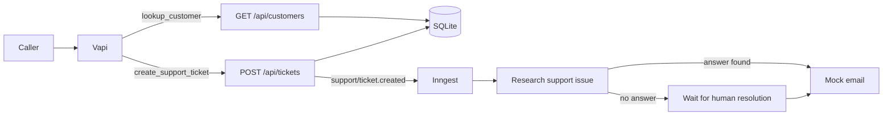

# Production Patterns for Voice Agents with Vapi + Inngest

A standalone, local-only webinar demo. Vapi handles the conversation, two narrowly scoped API Request tools call the application APIs directly, and Inngest runs the durable support workflow. It illustrates production patterns without claiming that the demo itself is a production deployment.

## Architecture



## What is included

- A local SQLite database with one demo customer and one relevant knowledge article.
- Two Vapi API Request tools mapped directly to the application endpoints:
  - `lookup_customer({ contact })`
  - `create_support_ticket({ customerId, issue, ...optionalDetails })`
- Three Inngest functions: research, human-review wait, and mock email delivery.
- A visible, retryable handoff from ticket persistence to Inngest plus idempotent mock delivery.
- Vapi assistant, prompt, and tool payloads plus an idempotent provisioning script.
- Three Vapi Simulations for the confirmed flow, an adversarial no-match, and a retryable workflow-dispatch failure.
- Unit tests for the API request payload, duplicate prevention, and local domain behavior.

## Run locally

```bash
npm install
npm run setup:local
npm run dev
```

The app runs at `http://localhost:3000`. The Inngest Dev Server runs at `http://localhost:8288`.

Test each endpoint without Vapi:

```bash
curl -H "authorization: Bearer $API_BEARER_TOKEN" \
  'http://localhost:3000/api/customers?contact=amanda.martin@example.com'

curl -X POST http://localhost:3000/api/tickets \
  -H "authorization: Bearer $API_BEARER_TOKEN" \
  -H 'content-type: application/json' \
  -d '{"requestId":"manual-demo-001","customerId":"cus_amanda","issue":"My replicator stopped working after the 9.4.0 update.","symptom":"The thermal-safety light flashes.","errorCode":"THERM-94"}'
```

Open the `research-support-ticket` run in the Inngest Dev Server. For a direct workflow test, use `POST /test` with the same parameters accepted by `create_support_ticket`.

Run the repeatable demo test after the app, Inngest Dev Server, and tunnel are running:

```bash
npm run test:demo
```

This verifies public health, bearer authentication, customer matching, idempotent ticket creation, conflict rejection, and completion of the Inngest workflow. The bearer credential authenticates the tool caller, not the human caller. The current caller-supplied contact is a demo account match and is not identity verification.

Test the saved Vapi assistant through Vapi's Chat API:

```bash
npm run test:vapi
```

This tests the confirmed, declined, and terminal no-match branches. The confirmed conversation creates a ticket, returns its caller-facing `REP-######` reference without exposing the internal UUID, and waits for the Inngest workflow to finish. The declined conversation verifies that Vapi never calls the ticket tool; the no-match conversation verifies one recheck followed by a terminal refusal.

## Test conversational behavior with Vapi Simulations

The project includes three versioned Vapi Simulation scenarios with structured, single-outcome evaluations and deterministic tool mocks. They focus on the highest-impact production behaviors for the webinar: correct tool order and confirmation, resisting an unknown caller's attempt to bypass the account boundary, and honest recovery from a retryable workflow-dispatch failure.

Simulation runs first compare the live assistant and tools with the versioned repository configuration. Deploy any intended changes, verify that the preflight passes, and then provision the simulation resources:

```bash
npm run deploy:vapi
npm run check:vapi-config
npm run setup:vapi-simulations
```

Run the suite in fast chat mode by default, or opt into the full audio path:

```bash
npm run test:vapi-simulations
npm run test:vapi-simulations -- --voice
```

Vapi currently describes Simulations as pre-release. The simulation runner is intentionally separate from `npm test` because runs use hosted models and voice mode adds audio cost. See [`vapi/simulations/README.md`](vapi/simulations/README.md) for the coverage assessment, rationale, and deliberate limits.

## Connect Vapi

Vapi requires a public HTTPS endpoint. Start the app, then expose port 3000:

```bash
npm run tunnel
```

Set `VAPI_API_KEY` in `.env`. Either set `PUBLIC_URL`, set a reserved `NGROK_DOMAIN`, or let the deployment script discover the currently running ngrok tunnel. Then run:

```bash
npm run setup:auth
npm run deploy:vapi
```

`setup:local` creates the random local bearer token used by the app. `setup:auth` reuses that token to create a Vapi Custom Credential, and deployment attaches the credential to both API Request tools. Protected API routes fail closed when authentication is not configured.

The script creates or updates two saved `apiRequest` tools and one assistant. `lookup_customer` calls `GET PUBLIC_URL/api/customers?contact={{contact}}`; `create_support_ticket` calls `POST PUBLIC_URL/api/tickets`. Vapi injects its server-generated `{{ call.id }}` as a hidden static `requestId`, so an HTTP retry reuses the original ticket and Inngest event. A successful response includes both the internal UUID and a short caller-facing reference; the assistant must speak only the latter. Tool and assistant IDs are attached through `model.toolIds` and written back to `.env` for subsequent updates.

The app requires `API_BEARER_TOKEN`; `setup:local` generates it and stores it in `.env`. Authentication is attached through Vapi's credential support rather than embedded in the tool payload.

## Environment

`setup:local` supplies the bearer token; `INNGEST_DEV=1` and `PORT=3000` select the local services. `OPENAI_API_KEY` is reserved for an optional live model-based research segment; this baseline demo uses deterministic local evidence. The temporary ngrok URL is only a bridge from Vapi to the local customer and ticket APIs.

## Durability boundary

Ticket creation starts in `event_pending`. The API changes the ticket to `researching` only after Inngest accepts the stable event ID. If event dispatch fails, the ticket remains durable as `event_failed`, the API returns a retryable `503`, and repeating the same tool request retries dispatch without creating another ticket. Inngest steps handle research, the human wait, and mock delivery; the mock outbound delivery is idempotent per ticket.

This is deliberately narrower than a deployed system. See `WEBINAR-PRESENTER-NOTES.md` for the production concerns to name aloud without building them into the local demo.

## Webinar path

1. Call the assistant and identify the seeded customer.
2. Show `lookup_customer` returning matched demo device context; do not describe it as identity verification.
3. Describe the thermal-safety issue and explicitly confirm ticket creation.
4. Show `create_support_ticket` returning immediately with separate `ticketSaved` and `workflowStarted` facts, an internal UUID for correlation, and a short `REP-######` reference for the caller.
5. Move to the Inngest UI and show the durable research steps continuing after the call boundary.
6. Repeat with an unrelated issue to demonstrate the human-review wait and resume it with `POST /api/tickets/:ticketId/resolve`.
